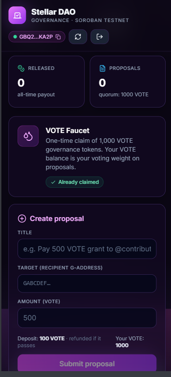

# 🟣 Stellar DAO

> **On-chain governance on Soroban** — propose, vote, and pay out treasury funds with verifiable, tamper-proof execution.

[](https://github.com/manojaggarwal812/stellar-dao/actions)


A live, end-to-end DAO built for the Stellar Frontend Challenge (Green Belt). Three Soroban contracts — `gov_token` (VOTE), `treasury`, and `proposal_registry` — wire together so that **funds can only leave the treasury via a passing proposal**. The frontend is a React + Vite + Tailwind app with Stellar Wallets Kit.
## Video Demo:- https://drive.google.com/file/d/1xi9OJ6XJEFpmwqO4O2Egw6nw2vKWHl8_/view?usp=sharing

## 📱 Mobile UI



---

## 🌐 Live deployment (Soroban Testnet)

| Contract | ID |
| :-- | :-- |
| `gov_token` (VOTE) | [`CD4NYD7H…C5OL`](https://stellar.expert/explorer/testnet/contract/CD4NYD7HJSXR7ZPSIOS2AGCZS2BKGBXU7IQLIJSJWYKBB6SYAFUMC5OL) |
| `treasury` | [`CDHB2BZJ…CFCF`](https://stellar.expert/explorer/testnet/contract/CDHB2BZJ4NG3WFI5CCEIFW7CRIHGZABPXHJUD6C4XLEVLF5MCOE2CFCF) |
| `proposal_registry` | [`CC2FUXIM…WYOB`](https://stellar.expert/explorer/testnet/contract/CC2FUXIMOZGHQFJOF5RGOTVWQVLG4WLGX7HF57VTJLZZIAVDJ3G6WYOB) |

**Frontend:** https://stellar-dao.onrender.com *(set up after pushing to GitHub — see [Deployment](#-deployment))*

---

## ✨ What it does

1. **Claim VOTE** — every wallet can claim **1,000 VOTE** once from the on-chain faucet. This is your voting weight.
2. **Propose** — lock **100 VOTE** as an anti-spam deposit and propose to release any amount of VOTE from the treasury to any address.
3. **Vote** — `for` or `against`. Your weight = your VOTE balance at vote time. One vote per wallet per proposal.
4. **Wait** — the voting window (1 hour on testnet) closes.
5. **Execute** — *anyone* can call `execute()` on a passing proposal and **earn a 5% executor reward**, while the proposer gets the remaining 95% of their deposit refunded. Three inter-contract calls fire in a single atomic transaction.
6. **Or finalize** — if the proposal lost or fell short of quorum, anyone can `finalize_defeated()` and the proposer's deposit is forfeited to the treasury (which incentivizes useful proposals).

> **Quorum:** 10% of an assumed 10,000 VOTE supply ⇒ 1,000 VOTE = exactly one full faucet claim.

---

## 🏗 Architecture

```
                          ┌──────────────────┐
                          │   gov_token      │  VOTE — voting weight
                          │  (faucet, mint,  │
                          │   transfer)      │
                          └────────▲─────────┘
                                   │ balance() · transfer()
            ┌──────────────────────┴───────────────────────┐
            │                                              │
   ┌────────▼─────────┐  release(target,amount) ┌──────────▼─────────┐
   │ proposal_registry│ ──────────────────────► │     treasury        │
   │  propose / vote  │ ◄──── (registry auth) ──│  holds VOTE         │
   │  execute(3 calls)│                          │  registry-gated     │
   └──────────────────┘                          └─────────────────────┘
```

### Inter-contract calls

| Operation | # of calls | Calls |
| :-- | :--: | :-- |
| `propose()` | 1 | `gov_token.transfer(proposer → registry, deposit)` |
| `vote()` | 1 | `gov_token.balance(voter)` (read-only weight lookup) |
| **`execute()`** | **3** | `treasury.release(target, amount)` + `gov_token.transfer(reg → executor, 5%)` + `gov_token.transfer(reg → proposer, 95%)` |
| `finalize_defeated()` | 1 | `gov_token.transfer(reg → treasury, deposit)` |

### Why three contracts?

Splitting concerns yields stronger guarantees:

* **`gov_token`** is a self-contained SEP-41-style token. It does not know about governance.
* **`treasury`** does not know what a "proposal" is — it only trusts `registry.require_auth()`. Swap the registry tomorrow and the treasury still works.
* **`proposal_registry`** is the policy engine. Quorum, voting period, and reward split live here, isolated from token mechanics.

---

## 🚀 Quick start

### Prerequisites

* **Node.js ≥ 20**
* **Rust + `wasm32v1-none` target**: `rustup target add wasm32v1-none`
* **[Stellar CLI](https://developers.stellar.org/docs/build/smart-contracts/getting-started/setup) ≥ 25**
* A funded testnet identity (e.g., `stellar keys generate deployer --network testnet --fund`)

### One-shot deploy

```powershell
# 1. Install
npm install

# 2. Deploy all three contracts to testnet (builds + initializes + bootstraps treasury)
powershell -ExecutionPolicy Bypass -File scripts/deploy.ps1 -Identity deployer

# 3. Run the dapp
npm run dev   # → http://localhost:5182
```

The script writes contract IDs into `.env.local` automatically.

### Run only the contract test suite

```bash
cd contracts
cargo test --workspace
# → 32 tests pass: 8 (gov_token) + 7 (treasury) + 17 (proposal_registry)
```

---

## 🧪 Tests at a glance

| Crate | # tests | Highlights |
| :-- | :--: | :-- |
| `gov_token` | 8 | faucet single-claim, transfer math, decimal/name/symbol metadata |
| `treasury` | 7 | deposit, release accounting, double-init guard, bad-amount rejection |
| `proposal_registry` | 17 | full lifecycle (propose → vote → execute), quorum failure, double-vote rejection, deadline-gated execute, defeated-proposal forfeit, the **3-inter-contract-call** path through `execute()` |

```
test result: ok. 8 passed; 0 failed; ...
test result: ok. 7 passed; 0 failed; ...
test result: ok. 17 passed; 0 failed; ...
```

---

## 📁 Project layout

```
stellar-dao/
├── contracts/                 # Cargo workspace (Soroban)
│   ├── gov_token/             #   VOTE token + faucet
│   ├── treasury/              #   Registry-gated vault
│   └── proposal_registry/     #   propose / vote / execute / finalize
├── scripts/
│   └── deploy.ps1             # One-shot testnet deploy
├── src/
│   ├── lib/
│   │   ├── config.ts          # Env + contract IDs
│   │   ├── wallet.ts          # StellarWalletsKit wrapper
│   │   ├── stellar.ts         # RPC + every contract call
│   │   ├── format.ts          # raw ↔ human, address shortening, durations
│   │   ├── errors.ts          # Contract-error → friendly message map
│   │   └── toast.tsx          # Lightweight toast system
│   └── components/
│       ├── WalletBar.tsx
│       ├── GovStats.tsx       # 4-card overview (your VOTE, treasury, …)
│       ├── FaucetCard.tsx
│       ├── CreateProposalForm.tsx
│       ├── ProposalList.tsx   # Active / Executed / Defeated tabs
│       └── ProposalCard.tsx   # Vote bars, quorum meter, action buttons
├── render.yaml · netlify.toml · public/_redirects
└── .github/workflows/ci.yml   # Test contracts + build frontend on every push
```

---

## 🔐 Trust model

* **Funds can only leave the treasury via a passing proposal.** The treasury stores only `registry_addr` and reverts every other caller.
* **Voting weight is read at vote time** from `gov_token.balance(voter)`. Wallet draining after voting does not retroactively unvote, but cannot increase a vote either (one-vote-per-wallet enforced).
* **Quorum is computed against an admin-set `total_supply_hint`.** This is a known trade-off for demo simplicity; a production version would either (a) snapshot total supply via a checkpointed ERC-20Votes-style design or (b) integrate with a SAC token for live supply reads.
* **Anti-spam:** unsuccessful proposals forfeit their 100 VOTE deposit to the treasury, which compounds the DAO fund and disincentivizes spam.

---

## 🌍 Deployment

### GitHub Actions

Push to `main`. The workflow runs:
* `cargo test --workspace` (Rust)
* `tsc --noEmit` + `vite build` (frontend)

### Render (recommended)

1. Push the repo to GitHub.
2. On [Render](https://render.com), *New → Static Site → connect this repo*.
3. Render auto-detects `render.yaml`. Set the three `VITE_*_ID` environment variables (copied from `.env.local`) in the dashboard.
4. Deploy. Done.

### Netlify

`netlify.toml` is included; configure the same `VITE_*` variables in the Netlify UI.

---

## 🛠 What I'd add next

* **ERC-20Votes-style snapshots** — currently the registry trusts a `total_supply_hint`. Snapshot supply at proposal-create time for tamper-proof quorum math.
* **Delegation** — let holders delegate voting power to representatives without transferring tokens.
* **Multi-target proposals** — currently one `(target, amount)` pair per proposal. Generalize to a `Vec<Action>`.
* **Off-chain proposal metadata** — store rationale on IPFS and link via content hash; the on-chain title is just a label.

---

## 📄 License

MIT.

---

> Built for the Stellar Frontend Challenge: DAO governance on Soroban with wallet-based voting and treasury execution.
